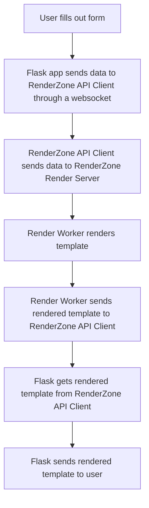

# How was it made?

An explanation of how we made RenderZone

## Table of contents

- [Initial plan](#initial-plan)
- [Frontend](#frontend)
- [Rendering a template](#rendering-a-template)
- [Backend](#backend)
- [Conclusion](#conclusion)

## Initial plan
Our initial plan was to use the following:
| Task | Technology |
| --- | --- |
| Frontend | Django |
| Backend | Django |
| Database | MariaDB |
| Rendering | AE Render Engine with NodeJS |
| Hosting | AWS EC2 |
But we quickly realised that this was not going to be the best option for us. So we switched some stuff around. And this is what we ended up with.

## Frontend
We decided to stay with Python on the frontend. But Django was a little overkill for our usecase, so we decided to use **Flask**! We also decided to use **Bootstrap** for styling, and **Jinja2** for templating.

## Rendering a template
For rendering After Effects templates there is really only 1 option, and that is **aerender.exe** file that comes with After Effects. But it is only available for Windows. We tried to get it running on linux which was unsuccessful. So we decided to use Windows Server 2019. We also decided to use **NodeJS** to run the rendering process. 
### This is what the rendering process looks like:

## Backend
Flask is great for fullstack development so we decided to use it for the backend as well.

## Conclusion
Overall we are very happy with the result of this project. We learned a lot about web development and rendering. 

### The final tech stack:
| Task | Technology |
| --- | --- |
| Frontend | Flask |
| Backend | Flask |
| Database | MongoDB |
| Rendering | AE Render Engine with NodeJS |
| Hosting | OVH VPS |
